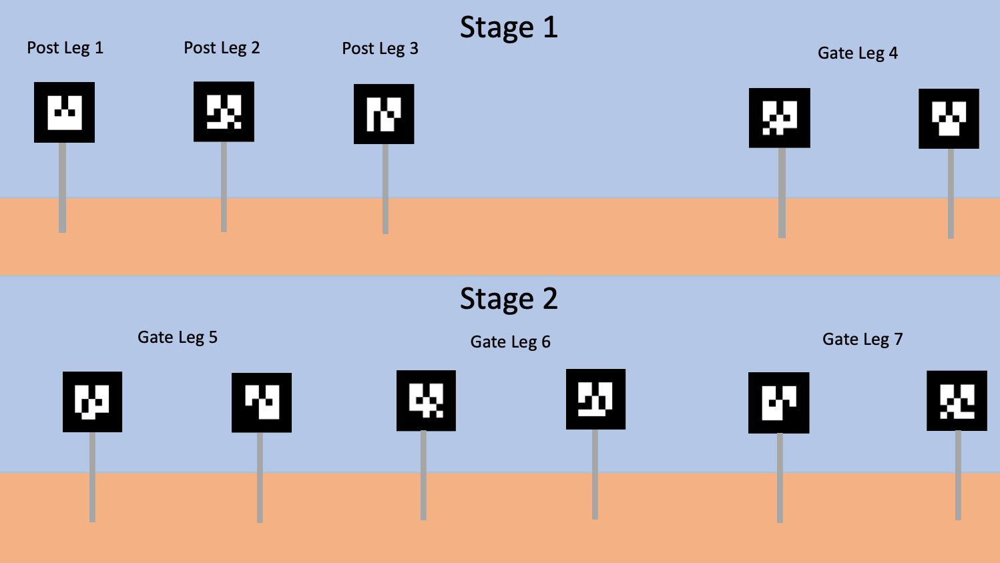

# Capstone Project
Your final assignment.

Navigate to [README](README.md) | [Module 5](module5.md) ⬅️ Capstone Project

---

## Introduction

The purpose of this capstone project is to encapsulate the knowledge you have gained through participating in the ROS track, while simultaneously tying this knowledge set back to the needs of the SJSU Robotics Team. Our assessment goals are to determine

* your grasp of fundamental ROS concepts,
* your ability to implement ROS nodes and debug them, and 
* your familiarity with ROS and ecosystem tools and formats

---

## Elaboration of SJSU Robotics Team Needs

The competition requirements and guidelines pertaining to autonomous navigation are listed in §3.e of [this PDF file](assignments/assets/University_Rover_Challenge_Rules_2020.pdf), and the addendum to these rules pertaining to autonomous navigation are listed [on this webpage](http://urc.marssociety.org/home/q-a#TOC-Autonomous-Traversal-Mission-Questions). Of particular interest are the AR tags atop the posts at the end of each navigation leg of the mission; these AR tags are the targets of the navigation task of this capstone project. An abstract depiction of these objects are shown below:

### Details

* Post: `30-100 cm` tall, topped by a three-sided triangular prism.
    * Each rectilinear side of the prism is `20 cm x 20 cm`
    * Each rectilinear side of the prism displays a black and white AR tag
* Gate: comprised of two posts
    * Posts are `2 m` or `3 m` apart

## Elaboration of the project

In this project, you will be tasked with implementing the navigation stack for the Robotics Team's simulated rover. Additionally, you will demonstrate its ability to autonomously navigate along a provided course. 

### Criteria

Successful completion of this project involves the following:

1. Combining all the requisite components listed in the resources.
2. Resolving bugs within the provided components.
3. Implementing a launch file to initialize the requisite components, the simulation world, and the rover model.
4. Demonstrating successful autonomous navigation
    * Navigating to specified GPS locations
    * Navigating towards AR tags 

### Going Beyond

While you are not expected to complete the following items, you are encouraged to try them out.

* Navigate through gates
* Implement a navigation indicator (in the form of an LED array), which behaves in the following way:
    * Solid red: autonomous operation
    * Solid blue: teleoperation
    * Flashing green: successful completion of leg
* Consider ways to improve the simulation
    * What are some shortcomings of the simulation world? What improvements would you make?
    * What are some shortcomings of the simulated sensors and actuators? What improvements would you make?
    * What are some limitations of the ROS stack that would prevent its success in a real implementation? What improvements would you make?

### Resources

* [File assets](capstone_resources/) for Gazebo simulation models, the rover model, ROS node configurations, and ROS launch files
* [Resource guide](https://docs.google.com/presentation/d/15zLG4EqfdG5vdmgWoRzqxEjwxvvbU3IoeM8RgJFA4cg/edit#slide=id.p) describing 
   * Gazebo world with simulated posts, gates, and AR tags
   * URDF files describing the rover’s model
   * RViz configuration
   * List of tools for generating navigation goals
   * Visualization of the ROS computation graph
   * Tree visualization of the ROS transforms
   * List of requisite ROS packages, nodes, topics, actions, and services, with
      * Links to package documentations
